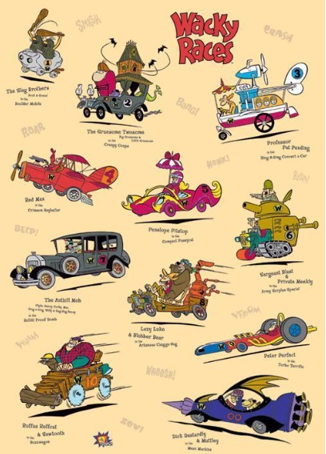

#  El alambique viajero

Los autos locos quieren participar en carreras alrededor del mundo.

### La inscripción

Los vehículos que quieran participar de la carrera deben inscribirse en el centro de inscripción. Cuando el centro recibe un vehículo verifica si puede o no competir en la ciudad donde acontecerá la carrera, si no puede no lo inscribe pero lo deja en una lista de rechazados. 
Puede ocurrir que durante el periodo de inscripción, antes que comience la carrera, haya una replanificación que implique cambiar la ciudad donde acontecerá la carrera. Si esto ocurre se vuelve a verificar que todos los vehículos anotados estén en condiciones de competir en la nueva ciudad, descartando a los que no lo estén y eventualmente incorporando a los que fueron rechazados anteriormente pero que puedan participar en la nueva sede. 

### La realización de la carrera

Cuando llega el momento oportuno, se le avisa a todos los vehículos anotados que vayan a la ciudad, lo cual implica que todos sufran las consecuencias del viaje (de la misma forma que la parte 1) 
El objetivo central es obtener al ganador de la carrera, que es el vehículo que completa la carrera en menos tiempo.  

### Las ciudades

Los requisitos para participar de las carreras en cada ciudad son los mismos que para viajar a ella (Como en la parte 1, el requisito para ingresar a Paris es que el vehículo pueda circular, lo que en el caso del Alambique Veloz sigue siendo que tenga el tanque lleno, pero para los demás vehículos la forma de determinarlo es diferente; en Buenos Aires, que el vehículo sea considerado rápido y de manera similar en las otras ciudades)

### Nuevos vehículos

Agregar estos nuevos vehículos:
- Uno de los autos, la "Antigualla Blindada" está integrada por varios gangsters, de quienes sólo conocemos sus nombres. Si bien originalmente son 7, antes de la carrera podrían bajarse alguno o subirse alguno más. Su velocidad se calcula a partir de la cantidad de letras de todos los nombres juntos. 
- El vehículo conducido por Pierre Nodoyuna y Patán si bien es más rápido que muchos otros, siempre intentan hacer trampas o perjudicar a los otros corredores y terminan tardando más en llegar a la meta.
- El profesor Locovich usa un vehículo que va cambiando de forma y simula ser otros. Implementarlo con una lista de posibles vehículos en los que se puede convertir sucesivamente y permitir que lo haga antes que comience la carrera.

### Pruebas

Hace algunos tests relevantes, en particular quien gana la carrera en los diferentes lugares donde podría hacerse.

